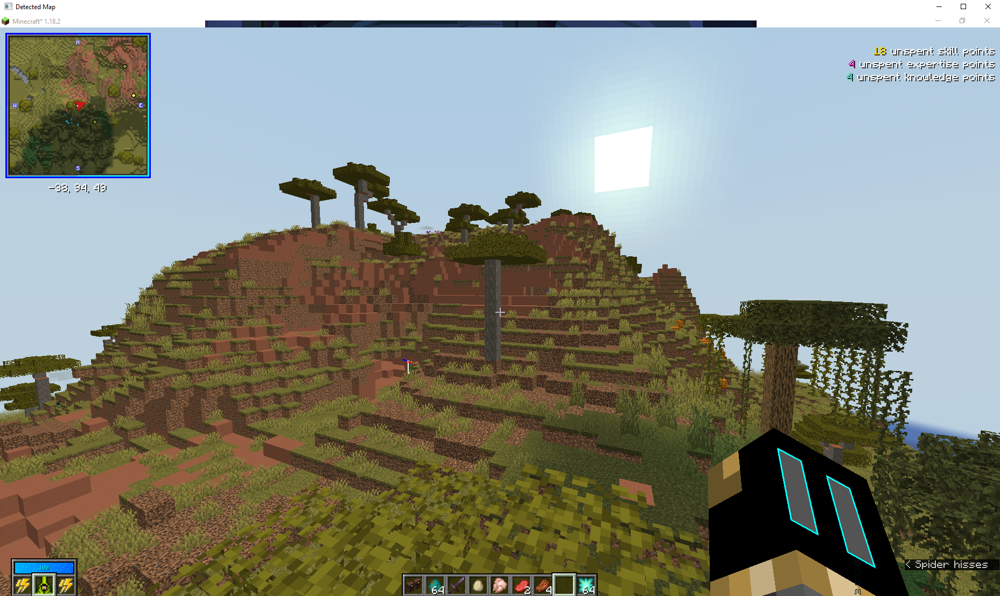

This project was built to do real time detection of the minimap in Minecraft, done using OpenCV and image processing techniques, then into a canny edge detection.

This was done using OpenCV and some sliders to adjust to capture wanted colours, using HSV color coding.

Results are as shown

